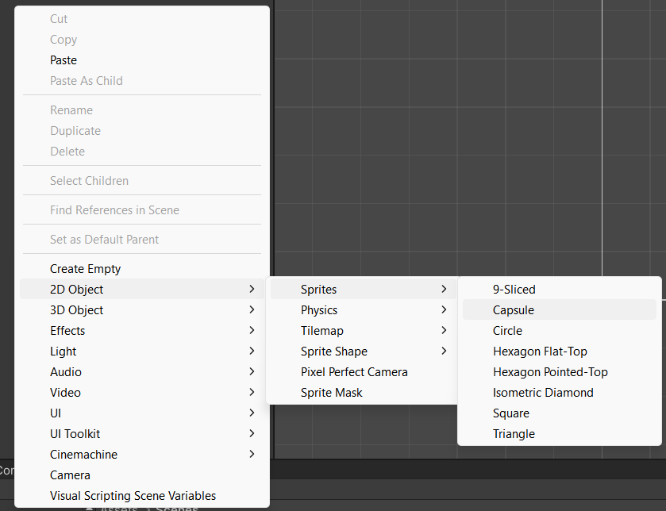
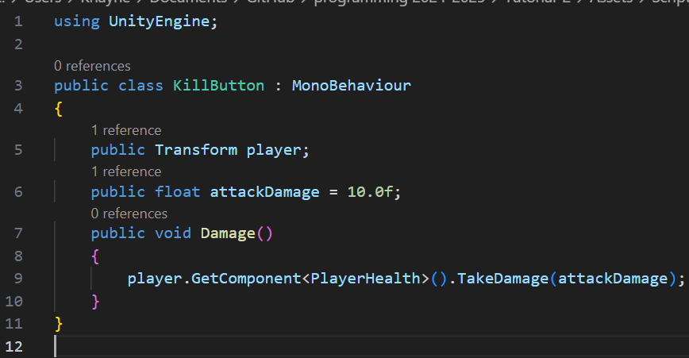
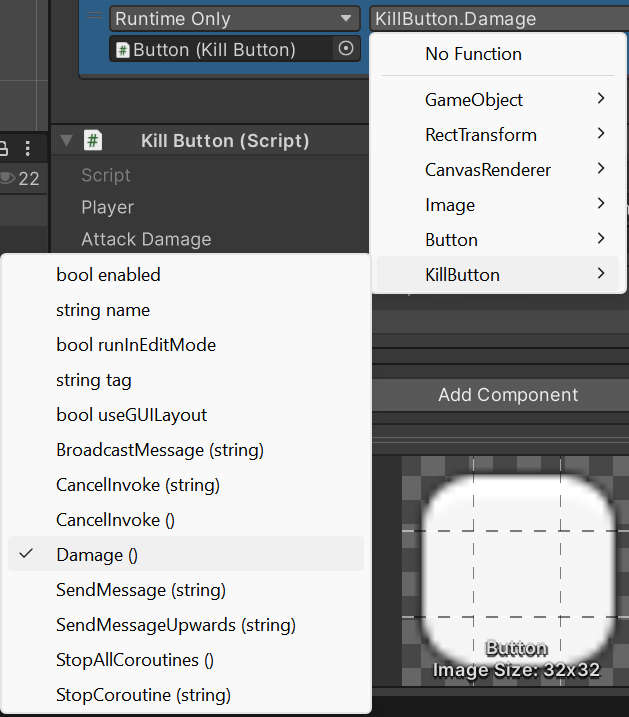

# How to make a UI element that show your health as text

Today we are going to make a Health UI in unity 2D, this tutorial includes a death menu that can be coded to take you back to the main menu as well as managing the player's death. This tutorial does not show you how to code the death screen to take you back to the main menu, only the UI for it. 

The version I will be using for this is 2022.3.46f1.

The first thing that we are going to do is make the required items in the hierarchy. We need to first make an empty game object. We will use this to keep our scene organised and hold our two canvases. You can find both in the image below.

Name the empty game object something such as Menu, I will use MenuStuff for this tutorial.

Name one of the canvases you will male DeathMenu and then another one called.

The death menu will be used for the menu that shows up then when you die while the game UI is simply what will hold the UI that will show things such as the health.

We want these to be child objects of the empty game object we made earlier. You can select both by holding the left control key while you are selecting both the canvases you just made. once done you should end up with something like this.

once you have done that, we want to now make the UI that will come up when the death menu is activated, for this tutorial I will add some text and also a button that can later be coded to take you to the main menu. 

I did this by simply adding some text that tells you that you died as well as a button that could be used to take you back to the main menu, you can use this button to do anything you want given that you have the code for it. I also used a panel that gives the menu a background. All of these can be found in the same place that you created the canvases from.

Once you have made your DeathMenu you then want to set it as inactive by making sure that the checkbox in the inspector is off. You can do this by selecting it in the hierarchy and then going to the inspector and then next to the name of the object you will find the checkbox. Here is an image of what it looks like.

You can see the checkbox that we need to toggle off in the top left of this screenshot above.

Now we will need to make a capsule to use as our object for the player, you can find this by right clicking on the hierarchy and then 2D object, sprite and then you can find the capsule there.

Once we have made our capsule, we then want to create a new script. We will call this script PlayerHealth. To add a new script, go to your project window then right click and go to create, then c# script. You can find it via the screenshot below. 

Once you have done that remember to name the script to PlayerHealth.

We then want to add all the code that is seen below, I will explain each part as well.

The first thing we need to do is declare our variables. We need four variables for this script. For the maxHealth we use [SerializeField] here to expose this value to unity, we then need to declare that it is a float which is a number that can have decimals as well. We will then set this variable's value to 100.0f, without the f at the end unity will not know that it is supposed to be a float. We then need the variable for our currentHealth which will also be a float, we want this variable to be public so it can be accessed by any script in our project. Once that is done, we then will make two more public variables using Game Object and then the name for both the DeathScreen and GameUI. This will allow us to set which game object it needs to point to within unity. 

We can now move into the start method, here we simply want to set the current health to the max health. This will happen each time the scene is loaded.

We then are going to make our own method; we will make this a public method and then void so that it does not return a value. we also want to put a variable for damage, which is a float, into the brackets for the method. 

Inside the method we then want to write the logic for taking away the player's health, we do this by using -+. This the same as doing currentHealth = currentHealth - damage. We then want to make an if statement that checks if the currentHealth Variable is zero or below, if so, it will activate the Die method.

The die method does not need to have public in front of it as we do not need it to be, as such we can just put void instead since unity will assume that you want it private. We then want to disable the game object that we have the script on, this will be the capsule that represents the player and then turn off the gameUI and set the time scale to 0f which will freeze time in the game. We then turn on the deathScreen then close off our method and then we are done with this script.

You then want to add this PlayerHealth script to your player game object, in our case that would be the capsule we had made earlier. You can add the script to the Capsule by simply dragging it on top of the object in the hierarchy or by going onto it and then adding a new component and then selecting your script from it. Assign your Death Screen to the DeathMenu game object and the Game UI to the GameUi game object so it looks like this, you can do this by simply dragging each game object into the script or doing it form the drop down within its component.

After that we need a way to display the health that the character has. We will do this by making two text objects, one of which will indicate what it is while the other text object is what we will be controlling. We will be controlling this via a quite simple script. You can find the Text - TextMeshPro object we are using via the screenshot below.

Once you have your two text objects you want to name the first one to Health and your second one to HealthText. Once that is done you will go ahead and make a new script just as before. Via right clicking on your project window where you can see your assets and then c# script. Here is a reminder of where it is in case you are having trouble finding it, it is under Create and then C# script.

Here is the code that we will use to make this.

This code is also a public class so that our PlayerHealth script can find it, we then get the playerhealth variable from our PlayerHealth script. After that we then need to get the text object that we want to use to display the current health of our player. Under the void start method, which does not return a value, we simply want to set what the healthText variable is so that we can use it. After that we will move onto the Update method, which also is void since it does not return a value, this is where we set the healthText variable to a colon as well as getting the currentHealth variable from our PlayerHealth script that we made earlier on and then convert it onto a string.

Once you have made the script then need to add it to the HealthText game object within unity. Once we have done that, we then need to drag our player object, in this case our Capsule, and then put it into the HealthText's script. Doing this will then allow the HealthText script to see the PlayerHealth script on our capsule and therefore be able to see the value of the currentHealth variable. Once you have done that you are then finished with making all the scripts needed for the health.

As for how you would oversee damage, we can make a button under the GameUI game object to test our health script as well as our health UI. To do this, we need to first make a script that will manage damaging the player. 

All we need to do is set the position for the player object and then the variable that will be used to set the amount of damage to deal. Then we will make a new public method called Damage, which is void as it returns no value and is also public so unity can see it, and simply get the PlayerHealth component from the player object and then use the TakeDamage method from that script with the attackDamage variable from our current script.

Once that is done, we then need to add the script to our button either by dragging it on top of it in the hierarchy, or via adding a new component to it while it is selected. Then we want to put Drag our Capsule into the script on the button so that our button knows what it is looking for. We then need to add an on click function by clicking the + icon just above where the script you just dragged the Capsule to. Once you have added an on click function, we then need to assign the button to the on click method via dragging the script you just added. Once you have done that. You will be able to change the function of button, we want to change it to the Damage function via KillButton and then choose Damage ().

You can then check if it works by going into play mode and seeing if clicking the button now depletes the counter on the health UI.

With that you are now done making your Health as text and also now have a way of dealing damage as the PlayerHalth script handles the damage and your enemy scripts, if you make any, will only have to pass along the amount of damage to take away from your player's health.

Thank you for using this tutorial and I hope you have a great day, night or evening.